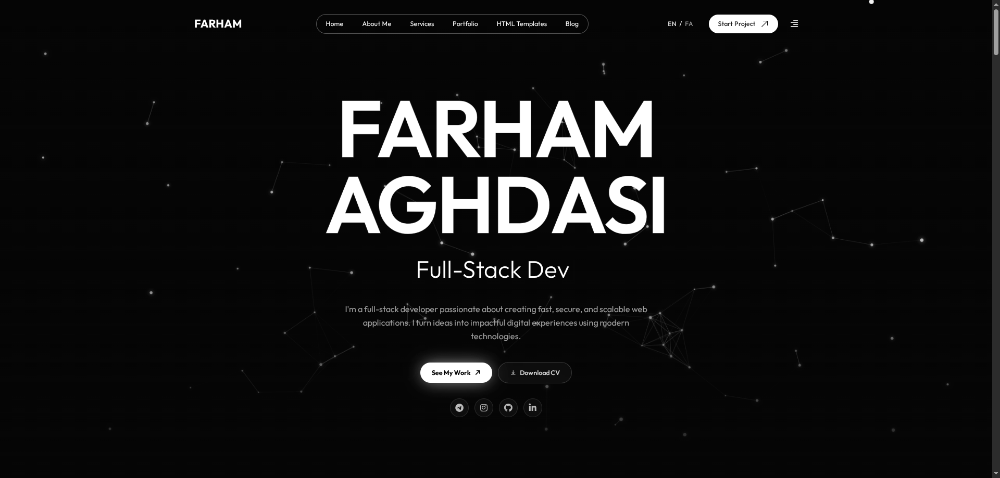

# Farham Aghdasi — Personal Portfolio

A modern, responsive, bilingual personal portfolio built with **Next.js 16**, **React 19**, and **TypeScript**. It uses **Static Site Generation** (`output: 'export'`) for fast, pre-rendered pages, with separate English and Persian (RTL) sections, SEO metadata, JSON-LD schema, and interactive animations.

## Features

- **Static Site Generation** via `next build` + `next export`
- **English + Persian (RTL)** content with dedicated route segments
- **Dynamic routes** for blog posts, portfolio items, and templates
- **SEO**: per-page metadata, `next-sitemap`, and custom multi-locale sitemap generation
- **Schema.org JSON-LD** (`Person`, `WebSite`, `WebPage`, `BreadcrumbList`, `Product`)
- **Interactive UI**: GSAP animations, particle canvas, TextSplitter, smooth scroll, pagination
- **Data-driven content** from JSON in `src/data/en/` and `src/data/fa/`
- **Custom fonts**: Outfit (English) and IRANYekan (Persian)
- **Tailwind CSS v4** with PostCSS and PurgeCSS

## Tech Stack

- **Framework**: Next.js 16.3.5 (App Router, static export)
- **UI**: React 19, TypeScript, Tailwind CSS v4
- **Animations**: GSAP, ScrollTrigger
- **Icons**: FontAwesome
- **SEO**: next-sitemap, custom sitemap script, JSON-LD
- **Tooling**: ESLint, PostCSS, PurgeCSS

## Project Structure

```
├── .github/workflows/deploy.yml   # CI/CD: build + FTP deploy
├── scripts/
│   └── generate-sitemaps.js       # Multi-locale sitemap generation
├── public/
│   ├── assets/                    # Static images and uploads
│   └── rtl-scraper.php            # RTL Theme info scraper
├── screenshots/
│   └── home.png                   # Homepage screenshot
├── src/
│   ├── app/
│   │   ├── [en pages]/            # English routes (about, blog, contact, portfolio, services, templates)
│   │   ├── fa/                    # Persian routes (same structure)
│   │   ├── layout.tsx             # Root layout
│   │   ├── page.tsx               # English home
│   │   ├── error.tsx              # Error boundary
│   │   └── not-found.tsx          # 404 page
│   ├── assets/
│   │   ├── css/                   # Custom CSS and FontAwesome fonts
│   │   └── fonts/                 # Outfit and IRANYekan fonts
│   ├── components/
│   │   ├── addon/                 # ParticleCanvas, SEO, TextSplitter, pagination, etc.
│   │   ├── pages/                 # Page-level components
│   │   ├── section/               # Reusable sections (portfolio, skills, blog, etc.)
│   │   ├── footer.tsx
│   │   ├── header.tsx
│   │   ├── hero.tsx
│   │   └── types.ts
│   └── data/
│       ├── en/                    # English JSON content
│       └── fa/                    # Persian JSON content
├── next.config.ts                 # Static export + image domains
├── next-sitemap.config.js         # Sitemap config
├── package.json
├── postcss.config.mjs
├── purgecss.config.js
├── tsconfig.json
└── README.md
```

## Internationalization

- **English**: served at root (`/`, `/about`, `/blog`, `/portfolio`, `/templates`, `/services`, `/contact`)
- **Persian**: served under `/fa` (`/fa/about`, `/fa/blog`, `/fa/portfolio`, `/fa/templates`, `/fa/services`, `/fa/contact`)
- Persian pages use RTL layout and the IRANYekan font
- Content and copy are maintained in `src/data/en/` and `src/data/fa/`

## SEO

- `generateMetadata` for per-page titles, descriptions, Open Graph, and Twitter cards
- `next-sitemap` plus `scripts/generate-sitemaps.js` for multi-locale XML sitemaps
- JSON-LD structured data on home and template detail pages

## Screenshots



## Getting Started

```bash
npm install
npm run dev
```

Open [http://localhost:3001](http://localhost:3001).

## Build

```bash
npm run build
npm run postbuild
```

Static output is generated in `out/`.

## Deployment

The included GitHub Actions workflow builds the site and deploys the `out/` directory via FTP.

## License

MIT
